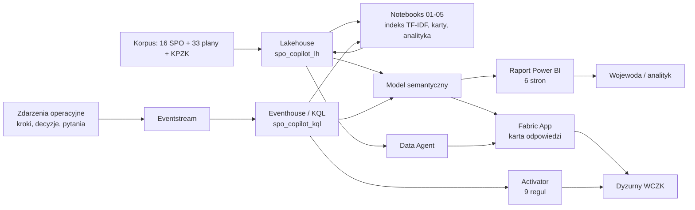

# SPO Copilot — asystent standardowych procedur operacyjnych

> ⚠️ **Dane w tym repozytorium są w 100% syntetyczne.** Zostały wygenerowane
> deterministycznie na potrzeby demonstracji możliwości Microsoft Fabric.
> Treść procedur odwzorowuje strukturę Standardowych Procedur Operacyjnych z KPZK,
> ale **nie jest dokumentacją operacyjną** żadnej instytucji i nie może być
> wykorzystywana w rzeczywistym zarządzaniu kryzysowym.

## O co chodzi

Dyżurny WCZK odbiera zgłoszenie o przerwaniu wału. Ma pięć minut i trzydzieści
dokumentów: SPO, plan zarządzania kryzysowego województwa, plan ochrony ludności,
siatkę bezpieczeństwa, procedury RCB. Pytanie brzmi nie „gdzie to jest zapisane",
tylko **„co mam zrobić w ciągu najbliższych 30 minut i kto to podpisuje"**.

To repozytorium pokazuje, jak zbudować w Fabric asystenta, który:

1. **odpowiada** — pytanie w języku naturalnym → właściwa procedura, checklista kroków
   z czasami normatywnymi, cytowania do konkretnych fragmentów dokumentów;
2. **prowadzi** — checklista z odliczaniem czasu, dokumentami do wytworzenia
   i wpisem do dziennika decyzji;
3. **uczy się** — analityka pokazuje, które kroki chronicznie nie mieszczą się w normie
   i które blokady wracają od lat.

## Najważniejsze liczby

| Wskaźnik | Wartość |
|---|---|
| Procedury w korpusie | **16 SPO / 155 kroków** |
| Dokumenty / fragmenty do wyszukiwania | **49 / 513** (199 tys. znaków) |
| Trafność routingu (top-1 / top-3 / MRR) | **90,6% / 93,8% / 0,932** |
| Uruchomienia procedur w danych | **986** (2023–2026, w tym 26 w scenariuszu powodziowym) |
| Wykonania kroków | **9 420** |
| Dotrzymanie czasów normatywnych | **76,1%** ogółem, **70,5%** w scenariuszu powodziowym |
| Najgorszy krok | SPO-3 krok 4 — **89,9% wykonań po czasie** |
| Najczęstsza blokada | „Nieaktualna lista punktów kontaktowych operatorów IK" — **201 wystąpień w 4 lata** |
| Mediana czasu do pierwszego kroku krytycznego | **19,3 min** |
| Wpisy w dzienniku decyzji | **2 002** (28,4% niejawnych) |
| Zapytania do asystenta (telemetria) | **4 200**, p50 **1 443 ms**, p95 **2 142 ms** |

## Trzy momenty „wow"

1. **Pytanie → gotowa karta w sekundę.** „Pękł wał przeciwpowodziowy, woda zalewa dwie
   wsie, potrzebna ewakuacja i ostrzeżenie mieszkańców" → SPO-3 (informowanie ludności),
   rzecznik RCB jako właściciel, 11 kroków z czasami normatywnymi, cytowania do
   konkretnych fragmentów. Bez czytania dokumentów.
2. **Ta sama blokada 201 razy.** Analityka pokazuje, że przez cztery lata,
   w kilkunastu różnych procedurach, kroki blokowała jedna rzecz: nieaktualna lista
   kontaktów do operatorów infrastruktury krytycznej. To nie jest alert operacyjny —
   to wniosek do decyzji zarządczej.
3. **Krok, który nigdy nie mieści się w normie.** SPO-3 krok 4 (wersje językowe
   komunikatu ostrzegawczego) przekracza czas normatywny w 89,9% wykonań.
   Albo norma jest nierealna, albo procesu nie da się wykonać ręcznie —
   dane rozstrzygają którą hipotezę sprawdzić.

## Wyniki z ostatniego przebiegu

<!-- RESULTS_START -->
- Korpus: 16 procedur SPO, 155 krokow, 49 dokumentow, 513 fragmentow (198746 znakow), slownik indeksu 1816 termow.
- Wymiary: 22 rol, 20 zagrozen, 32 pytan kontrolnych.
- Zdarzenia: 986 uruchomien procedur, 9420 wykonan krokow, 2002 wpisow w dzienniku decyzji, 4200 zapytan do asystenta.
- Trafnosc routingu: top-1 90.6%, top-3 93.8%, MRR 0.932 na 32 pytaniach (3 pudla).
- Telemetria asystenta: trafnosc 93.5%, p50 1443 ms, p95 2142 ms, ocen "pomocne" 46.3%.
- Czasy normatywne: dotrzymanie 76.1% ogolem, 70.5% w scenariuszu powodziowym; najgorsza procedura SPO-2 (70.7%).
- Najgorszy krok: SPO-3 krok 4 - 89.9% wykonan po czasie (Przygotowanie wersji obcojezycznych i dostepnych dla osob z niepelnosprawnosciami).
- Najczestsza blokada: "Nieaktualna lista punktow kontaktowych operatorow infrastruktury krytycznej" - 201 wystapien w 4 lata.
- Przebieg: mediana czasu do pierwszego kroku krytycznego 19.3 min, mediana trwania procedury 38.9 h, decyzje niejawne 28.4%.
<!-- RESULTS_END -->

## Architektura



Szczegóły: [`ARCHITECTURE.md`](ARCHITECTURE.md) i [`architecture.mmd`](architecture.mmd).

## Zawartość repozytorium

| Ścieżka | Opis |
|---|---|
| `corpus/spo_content.py` | treść merytoryczna 16 SPO, role, zagrożenia, pytania kontrolne |
| `corpus/retriever.py` | indeks TF-IDF, wyszukiwanie i routing pytanie → procedura |
| `generate_datasets.py` | generator wszystkich zbiorów (`seed=42`) |
| `simulate_realtime.py` | symulator czterech strumieni do Eventstream (`--dry-run` offline) |
| `notebooks/01`–`05` | ładowanie korpusu, budowa indeksu, karty odpowiedzi, ewaluacja, analityka |
| `notebooks/06_semantic_prep.py` | warstwa semantyczna w Lakehouse (kolumny czasu, kolumny wyliczane, `dim_date`) — tylko Fabric |
| `kql/01`–`06` | tabele, zasady aktualizacji, zapytania dashboardu, alerty, wyszukiwanie w korpusie, ingest historii |
| `deploy_fabric.py`, `fabric/` | automatyczne wdrożenie w Fabric (OneLake, notatniki, KQL, model semantyczny, raport) |
| `semantic-model/` | opis modelu gwiazdy i 28 miar DAX |
| `report/REPORT_SPEC.md` | specyfikacja raportu (6 stron) |
| `fabric-app/` | specyfikacja aplikacji + prompt do generatora UI |
| `activator/RULES.md` | 9 reguł alertowych |
| `ai/DATA_AGENT.md` | instrukcja systemowa i 24 pytania akceptacyjne dla Data Agenta |
| `datasets/` | wygenerowane dane (wymiary CSV, zdarzenia JSONL, zbiory pochodne) |
| `DATA_MODEL.md` | słownik wszystkich tabel i kolumn |
| `DEMO_SCRIPT.md` | scenariusz pokazu (12 minut) |
| `SETUP_FABRIC.md` | instrukcja wdrożenia w Fabric |

## Uruchomienie lokalne

Wymagania: Python 3.10+, `numpy`, `pandas`.

```powershell
cd C:\repos\OchronaLudnosci\ol-spo-copilot
pip install -r requirements.txt

python generate_datasets.py          # wymiary, korpus, zdarzenia
python notebooks\01_load_corpus.py   # walidacja korpusu + mostek procedura-zagrozenie
python notebooks\02_build_vector_index.py
python notebooks\03_assistant_answers.py
python notebooks\04_retrieval_eval.py
python notebooks\05_step_analytics.py

python simulate_realtime.py --dry-run                # probka strumienia bez Fabric
python update_results.py                            # odswiez liczby w dokumentacji
```

Cały łańcuch wykonuje się poniżej minuty i jest w pełni powtarzalny.

## Mapowanie na funkcje Fabric

| Funkcja Fabric | Gdzie użyta |
|---|---|
| Lakehouse (Delta) | korpus, wymiary, indeks, karty odpowiedzi |
| Eventstream | cztery strumienie operacyjne |
| Eventhouse / KQL Database | analityka czasu rzeczywistego, wyszukiwanie pełnotekstowe |
| Notebooks (PySpark / Python) | budowa indeksu, ewaluacja, analityka |
| Model semantyczny Direct Lake | wspólna warstwa miar dla raportu i aplikacji |
| Power BI | raport sześciostronicowy |
| Activator | reguły alertowe na strumieniu kroków |
| Data Agent | odpowiedzi w języku naturalnym nad modelem |
| Fabric App | interfejs dyżurnego (karta odpowiedzi + checklista + decyzja) |

## Scenariusz osiowy programu

Repozytorium jest częścią programu demonstracyjnego „Ochrona Ludności".
Wszystkie scenariusze dzielą oś czasu **POWÓDŹ WRZESIEŃ**: `D0 = 2026-09-15 06:00+02:00`,
okno D-3 … D+10, województwa dolnośląskie (02) i opolskie (16) na pierwszym planie.
Dzięki temu dane z różnych repozytoriów można pokazywać obok siebie.

## Licencja

MIT — zob. [`LICENSE`](LICENSE).
